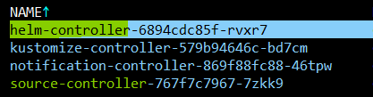

# FluxCD

## Getting started

Check your environment for fluxcd deployment
```bash
flux check
```

if check is't not OK please resolve it


## Create flux infrastructure

Bootstrap flux infra in k8s cluster
```bash
export GITHUB_USER=essemenoff
flux bootstrap github \
 --owner=$GITHUB_USER \
 --repository=essemenoff/cheatsheets \
 --branch=flux_test \
 --path=k8s/01_flux/clusters/production \
 --personal
```
This command creates:
|Item|Value|Note|
|Repo|essemenoff/cheatsheets| If it doesn't exist
|Branch|flux_test||
|Folder|k8s/01_flux/clusters/production||

flux creates a branch 'flux_test' with a content in path 
'k8s/01_flux/clusters/production/flux-system'.
|Name|Purpose|
|-|-|
|gotk-components.yaml||
|gotk-sync.yaml||
|kustomization.yaml||

See a merged changes in path 'k8s/01_flux/clusters/production/flux-system'.


### Install components

Install source-controller and helm-colntroller components in flux-system
```bash
flux install \
--namespace=flux-system \
--network-policy=false \
--components=source-controller,helm-controller
```

See installed components
```bash
kubectl get pods -n flux-system
```


## Publish simple application (manually)

Add podinfo's Helm repository to your cluster and configure Flux to check for new chart releases every ten minutes (choose a one):
1. Helm repo
```bash
flux create source helm podinfo \
--namespace=default \
--url=https://stefanprodan.github.io/podinfo \
--interval=10m
```

2. Git repo

```bash
flux create source git podinfo \
  --namespace=default \
  --url=https://github.com/stefanprodan/podinfo \
  --branch=master
```


Create a podinfo-values.yaml file locally:
```bash
cat > podinfo-values.yaml <<EOL
replicaCount: 2
resources:
  limits:
    memory: 256Mi
  requests:
    cpu: 100m
    memory: 64Mi
EOL
```

Create a Helm release for deploying podinfo in the default namespace:
1. Helm repo
```bash
flux create helmrelease podinfo \
--namespace=default \
--source=HelmRepository/podinfo \
--release-name=podinfo \
--chart=podinfo \
--chart-version=">5.0.0" \
--values=podinfo-values.yaml
```

2. Git repo

```bash
# flux create helmrelease podinfo \
# --namespace=default \
# --source=GitRepository/podinfo \
# --release-name=podinfo22 \
# --chart=./charts/podinfo \
# --chart-version=">5.0.0" \
# --values=podinfo-values.yaml
flux create hr podinfo \
  --interval=10m \
  --source=GitRepository/podinfo \
  --chart=./charts/podinfo
```

Check using standart kubectl
```bash
kubectl get hr
# or
kubectl get hr -o yaml
kubectl get hc
```

Check releases
```bash
flux get helmreleases -n default
```

To delete podinfo's Helm repository and release from your cluster run
```bash
flux -n default delete source helm podinfo
flux -n default delete helmrelease podinfo
```

## Remove all Flux stuff

``bash
flux uninstall --namespace=flux-system
```


## Useful link
* https://fluxcd.io/flux/installation/#github-and-github-enterprise


## Useful commands

```bash
flux get kustomizations --watch
```


```bash
flux get source helm
flux get source git
```


flux create helmrelease podinfo \
--namespace=default \
--source=GitRepository/podinfo \
--release-name=podinfo \
--chart=podinfo \
--chart-version=">5.0.0" \
--values=podinfo-values.yaml
